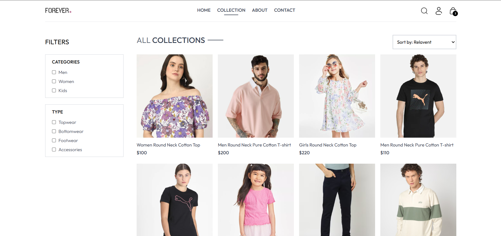
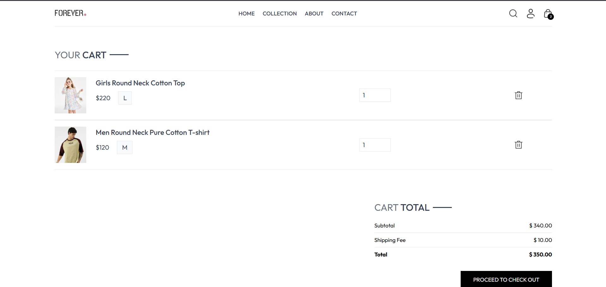
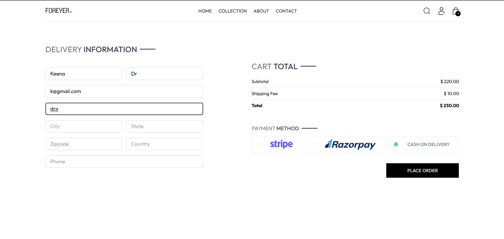
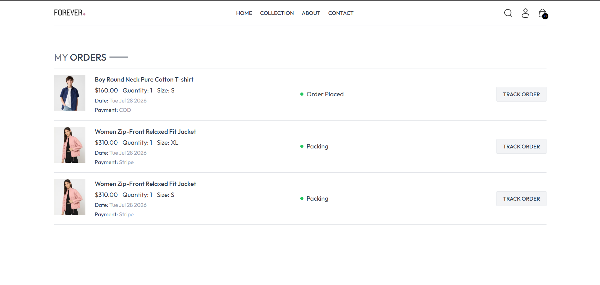
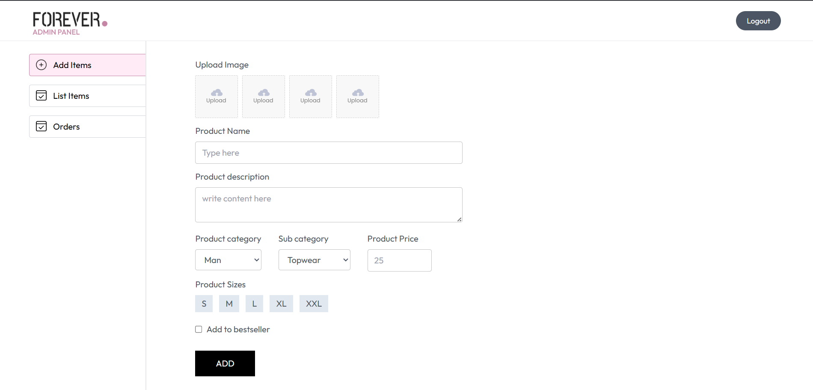

# 🛍️ MERN Stack E-Commerce Website

A full-stack e-commerce web application built using the **MERN Stack** (MongoDB, Express.js, React.js, Node.js). Users can browse products, add items to their shopping cart, securely authenticate, place orders, and complete payments through **Stripe**.

The project also includes a separate **Admin Panel** where administrators can add and manage products, monitor orders, and update order status.

---

## 📌 Features

### Customer Features

- User Registration & Login (JWT Authentication)
- Browse Products
- Search Products
- Filter Products by Category & Subcategory
- Sort Products by Price
- View Product Details
- Add Products to Cart
- Update Cart Quantity
- Remove Products from Cart
- Persistent Cart (synced to database per user)
- Checkout Page
- Cash on Delivery (COD)
- Stripe Payment Gateway
- Order History
- Mobile Responsive UI

### Admin Features

- Secure Admin Login
- Add New Products (with multiple image uploads via Cloudinary)
- Delete Products
- View All Orders
- Update Order Status
- Bulk Product Upload via Script

---

## 🛠 Tech Stack

**Frontend:** React.js, Vite, React Router DOM, Axios, Tailwind CSS, React Toastify

**Backend:** Node.js, Express.js, MongoDB, Mongoose, JWT Authentication, Bcrypt, Validator, Multer, Cloudinary, Stripe SDK

**Database:** MongoDB Atlas

**Image Storage:** Cloudinary

**Payment Gateway:** Stripe Checkout

---

## 📂 Folder Structure

```
ECommerce/
│
├── frontend/
│   ├── src/
│   │   ├── assets/
│   │   ├── components/
│   │   ├── context/
│   │   ├── pages/
│   │   ├── App.jsx
│   │   └── main.jsx
│   ├── public/
│   └── package.json
│
├── backend/
│   ├── config/
│   ├── controllers/
│   ├── middleware/
│   ├── models/
│   ├── routes/
│   ├── server.js
│   └── package.json
│
├── admin/
│   ├── src/
│   ├── App.jsx
│   └── package.json
│
└── README.md
```

---

## ⚙️ Installation

### Clone the repository

```bash
git clone https://github.com/yourusername/ECommerce.git
cd ECommerce
```

### Backend Setup

```bash
cd backend
npm install
npm run server
```

### Frontend Setup

```bash
cd frontend
npm install
npm run dev
```

### Admin Panel Setup

```bash
cd admin
npm install
npm run dev
```

---

## 🔑 Environment Variables

### Backend (`.env`)

```env
PORT=4000

MONGODB_URI=Your MongoDB Atlas Connection String

JWT_SECRET=Your JWT Secret

ADMIN_EMAIL=Admin Email
ADMIN_PASSWORD=Admin Password

CLOUDINARY_NAME=Cloudinary Cloud Name
CLOUDINARY_API_KEY=Cloudinary API Key
CLOUDINARY_SECRET_KEY=Cloudinary Secret

STRIPE_SECRET_KEY=Stripe Secret Key
```

### Frontend (`.env`)

```env
VITE_BACKEND_URL=http://localhost:4000
```

### Admin (`.env`)

```env
VITE_BACKEND_URL=http://localhost:4000
```

---

## 📡 API Routes

### User Routes — `/api/user`

| Method | Endpoint   | Description    |
|--------|-----------|-----------------|
| POST   | /register | Register User   |
| POST   | /login    | Login User      |
| POST   | /admin    | Admin Login     |

### Cart Routes — `/api/cart`

| Method | Endpoint | Description          |
|--------|----------|----------------------|
| POST   | /add     | Add Item to Cart     |
| POST   | /get     | Get User's Cart      |
| PUT    | /update  | Update Cart Quantity |

### Product Routes — `/api/product`

| Method | Endpoint | Description     |
|--------|----------|-----------------|
| POST   | /add     | Add Product     |
| POST   | /remove  | Delete Product  |
| GET    | /list    | List Products   |
| POST   | /single  | Single Product  |

### Order Routes — `/api/order`

| Method | Endpoint       | Description            |
|--------|----------------|-------------------------|
| POST   | /place         | Place COD Order         |
| POST   | /place-stripe  | Place Stripe Order      |
| POST   | /verify-stripe | Verify Stripe Payment   |
| POST   | /userorders    | User Order History      |
| POST   | /list          | Admin: All Orders       |
| POST   | /status        | Admin: Update Order Status |

---

## 🔐 Authentication Flow

1. User registers an account.
2. Password is hashed using bcrypt before storage.
3. On successful login, a JWT token is generated and returned.
4. Token is stored in the client (localStorage) and attached to protected requests.
5. Middleware verifies the token on protected routes (cart, orders) and attaches `userId` to the request.
6. Invalid or missing tokens are rejected before reaching the controller.

---

## 🛒 Shopping Flow

```
User Login
    │
    ▼
Browse Products
    │
    ▼
Add to Cart (synced to DB)
    │
    ▼
Checkout
    │
    ▼
Choose Payment Method
    │
    ├── Cash on Delivery ──► Order Placed
    │
    └── Stripe ──► Stripe Checkout ──► Payment Verification ──► Order Confirmed
```

---

## ☁️ Image Upload Flow

```
Admin Uploads Images
        │
        ▼
Multer Receives Files
        │
        ▼
Cloudinary Upload
        │
        ▼
Image URLs Stored in MongoDB
        │
        ▼
Frontend Displays Images
```

For bulk product loading, a custom Node script (`bulkUpload.js`) posts to `/api/product/add` in sequence, reusing the same Cloudinary upload pipeline as the admin panel form.

---

## 🗄 Database Collections

**Users**
```
name
email
password
cartData
```

**Products**
```
name
description
price
category
subCategory
sizes
bestseller
image[]
date
```

**Orders**
```
userId
items
amount
address
paymentMethod
payment
status
date
```

---

## 🚀 Future Improvements

- Wishlist
- Product Reviews & Ratings
- Coupon System
- Forgot Password Flow
- Admin Dashboard Analytics
- Stock Management
- Product Recommendations
- Dark Mode

---

## 📸 Screenshots

### Home Page


### Products Page


### Cart


### Checkout


### Order History


### Admin Dashboard


---

## 📦 Dependencies

**Backend:** express, mongoose, dotenv, cors, jsonwebtoken, bcrypt, validator, multer, cloudinary, stripe, nodemon

**Frontend:** react, react-router-dom, axios, tailwindcss, react-toastify

---

## 🧪 Testing

Tested using Postman, browser DevTools (Network/Console), and Stripe test cards.

---

## 👨‍💻 Author

Developed by **Kanika**

---

## 📜 License

This project is licensed under the MIT License.

---

⭐ If you found this project useful, consider giving the repository a star!
